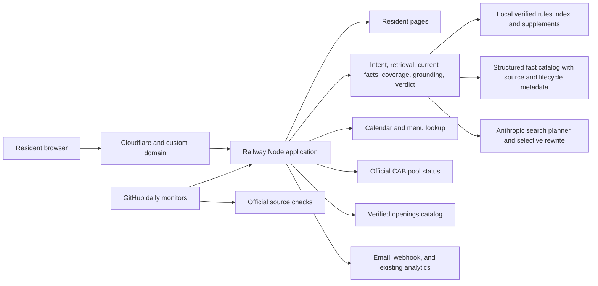

# System architecture

This is a deliberately small, single-service application for the product’s current traffic. The same tested code runs in separate Railway staging and production environments.

## Release boundaries

- `staging` deploys to the public but unadvertised test URL. Every page shows a purple staging badge, test traffic does not enter production Google Analytics, and notification destinations are disabled.
- `main` deploys to production. Railway sends traffic to a new release only after `/api/health` confirms that the rules index is ready.
- Daily GitHub checks exercise the homepage, security headers, rules answers, pool status, openings catalog, and eight days of food-truck lookups.

## Failure boundaries

- Anthropic helps interpret unfamiliar wording and may rewrite a weak draft, but it never supplies the governing facts. If it is disabled, unavailable, or fails grounding checks, the source-built answer still works.
- Strong source-built answers bypass rewriting, reducing cost and avoiding unnecessary answer drift.
- Prompt-injection screening runs before source search or Anthropic, including attempts to disclose prompts, credentials, tokens, environment variables, or webhook URLs.
- Missing or conflicting current rule facts fail closed instead of being guessed.
- The intent layer normalizes common wording and typo variants, keeps unrelated meanings separate, and records the requested answer facet before retrieval.
- The coverage gate rejects answers that cite a relevant-looking section but omit the resident's requested price, limit, process, link, definition, duration, or permission decision.
- All 116 historical resident wordings, broader family variants, and a separate unseen-question set run before release. The same resident corpus runs daily after deployment.
- Official resident-resource links are cataloged separately from rules and checked daily, which prevents the assistant from treating a stale convenience link as a governing rule.
- A failed pool-source request sends residents to the official CAB page.
- Openings source changes are queued for human review rather than automatically published.
- Alert, Notion, analytics, and tip integrations cannot prevent the resident site from answering.

## Rules Assistant boundaries

The Rules Assistant is no longer one undifferentiated block. Its safety classification, intent and requested-detail checks, source lifecycle rules, structured fact extraction, focused answer families, answer formatting, grounding, verdicts, optional AI work, and live-monitor decisions live in separate modules. `lib/rules-assistant.js` remains the coordinator while these pieces can be tested independently.

Every source refresh also rebuilds `data/rules-fact-catalog.json`. The catalog records each detected changing value with a stable fact key, normalized value, scope, effective and expiration dates, source URL, and source hash. The release check fails when that catalog no longer matches the rulebook or adopted supplements.

## Scaling trigger

The application intentionally uses one process and bounded in-memory caches/rate limits. If Railway is changed to run more than one production replica, move rate limits and shared caches to an edge or shared store before scaling. At the current single-replica traffic level, adding that infrastructure would add cost and operational complexity without improving resident outcomes.

## Reusable community-answer product

The product direction is broader than a rules chatbot. Its core promise is to make official community information direct, specific, human-readable, and easy to find. A customer starts with one input—the community's main public website—and the setup pipeline discovers and connects the official systems behind it.

The `/community-demo` staging page is the first working onboarding slice. It safely inspects a public homepage, detects CivicPlus Web Central, groups discovered links by resident need, explains the authority assigned to each source type, and produces a review-only setup plan. It never publishes scraped content automatically.

The existing Sterling Ranch Society tools provide the first reusable connectors and operating patterns:

- Rules and documents: Municode ingestion, supplement review, structured changing facts, citations, and answer audits.
- Community events: CivicPlus calendar ingestion, event-specific food-truck discovery, and the combined resident calendar.
- Facilities and actions: CivicPlus/CivicRec pages, current prices, direct booking or contact paths, and action-link coverage checks.
- Live status: the CAB pool page translated into accessible plain English.
- Local information: the openings catalog's source fingerprinting, review queue, and daily change monitor.

Each future community receives a `community_id` and a source profile rather than copied Sterling Ranch logic. That profile records the official domain, platform, connected modules, authority rules, refresh schedule, and launch evaluation set. At answer time, AI may interpret a resident's wording and summarize retrieved material, but it cannot invent facts or overrule the source hierarchy.

The intended source hierarchy is:

1. Adopted code, rule, or policy for what is allowed or required.
2. Current facility, form, payment, and registration systems for transactions, prices, availability, and required steps.
3. Current alerts and calendars for time-sensitive information.
4. Official informational pages for services, contacts, and explanations.

Freshness is part of the product rather than a one-time setup task. Every connector should retain source URLs, fingerprints, last-checked times, and lifecycle dates; run daily change and broken-link checks; detect conflicting official sources; quarantine unsupported changing facts; and rerun a community-specific question set before changed answers are published.
