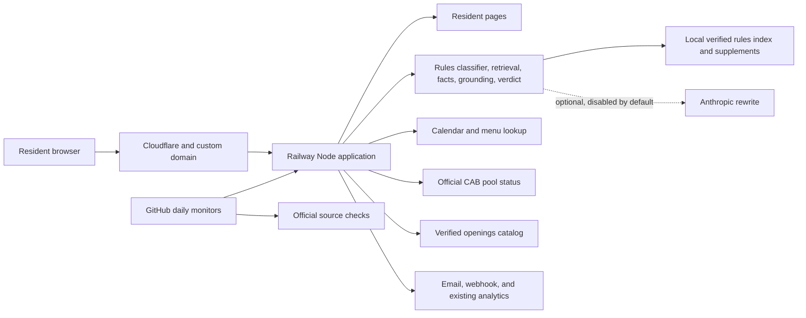

# System architecture

This is a deliberately small, single-service application for the product’s current traffic. The same tested code runs in separate Railway staging and production environments.

## Release boundaries

- `staging` deploys to the public but unadvertised test URL. Every page shows a purple staging badge, test traffic does not enter production Google Analytics, and notification destinations are disabled.
- `main` deploys to production. Railway sends traffic to a new release only after `/api/health` confirms that the rules index is ready.
- Daily GitHub checks exercise the homepage, security headers, rules answers, pool status, openings catalog, and eight days of food-truck lookups.

## Failure boundaries

- Rules answers remain deterministic if Anthropic is disabled or unavailable.
- Missing or conflicting current rule facts fail closed instead of being guessed.
- A failed pool-source request sends residents to the official CAB page.
- Openings source changes are queued for human review rather than automatically published.
- Alert, Notion, analytics, and tip integrations cannot prevent the resident site from answering.

## Scaling trigger

The application intentionally uses one process and bounded in-memory caches/rate limits. If Railway is changed to run more than one production replica, move rate limits and shared caches to an edge or shared store before scaling. At the current single-replica traffic level, adding that infrastructure would add cost and operational complexity without improving resident outcomes.
