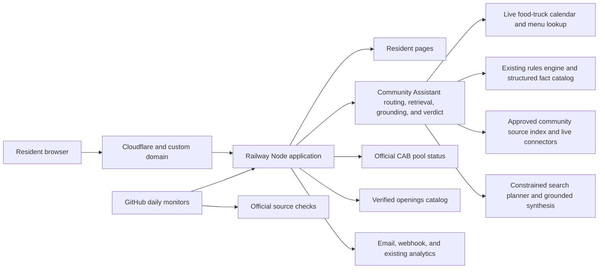

# System architecture

This is a deliberately small, single-service application for the product’s current traffic. The same tested code runs in separate Railway staging and production environments.

## Release boundaries

- `staging` deploys to the public but unadvertised test URL. Every page shows a purple staging badge, test traffic does not enter production Google Analytics, and notification destinations are disabled.
- `main` deploys to production. Railway sends traffic to a new release only after `/api/health` confirms that the rules index is ready.
- Daily GitHub checks exercise the homepage, security headers, rules answers, pool status, openings catalog, and eight days of food-truck lookups.
- A separate daily real-model routing benchmark sends labeled questions through the staging AI planner three times. Goal, subject, intent, repeat consistency, and prompt-injection rejection must meet the same thresholds used before release.
- The first application-code release remains deliberate. After it is live, the source-only workflow builds a candidate, runs the complete gates, soaks the exact bundle on staging for one hour, and then promotes only that bundle to production. A failed production verification reverts the source commit.

## Failure boundaries

- Anthropic helps interpret unfamiliar wording and may rewrite a weak draft, but it never supplies the governing facts. If it is disabled, unavailable, or fails grounding checks, the source-built answer still works.
- Strong source-built answers bypass rewriting, reducing cost and avoiding unnecessary answer drift.
- Prompt-injection screening runs before source search or Anthropic, including attempts to disclose prompts, credentials, tokens, environment variables, or webhook URLs.
- Missing or conflicting current rule facts fail closed instead of being guessed.
- The intent layer normalizes common wording and typo variants, keeps unrelated meanings separate, and records the requested answer facet before retrieval.
- The coverage gate rejects answers that cite a relevant-looking section but omit the resident's requested price, limit, process, link, definition, duration, or permission decision.
- All 116 historical resident wordings, broader family variants, a separate unseen-question set, and a 228-question old-versus-upgraded comparison run before release. Any regression blocks release.
- Official resident-resource links are cataloged separately from rules and checked daily, which prevents the assistant from treating a stale convenience link as a governing rule.
- A failed pool-source request sends residents to the official CAB page.
- Openings source changes are queued for human review rather than automatically published.
- Alert, Notion, analytics, and tip integrations cannot prevent the resident site from answering.

## Community Assistant boundaries

The existing rules engine remains the first route for topics it already answers well. The Community Assistant adds tenant profiles, source ingestion and cleaning, hybrid retrieval, live events/status connectors, claim-level grounding, optional AI search planning and synthesis, source conflict detection, and direct action links. These responsibilities live in separate modules; `lib/community-assistant.js` coordinates them without weakening the mature rules path.

The browser keeps at most three prior question-and-answer pairs in session storage. The server uses them only to turn a follow-up into a standalone search question, screens them for instruction attacks, and searches official evidence again. Prior answers are never treated as evidence and full conversation history is not persisted.

Every response has an `answerId`. A bounded operational trace records the route, planner goal and intent, source identifiers, verification result, source age, timing, fallback reason, and approximate AI token cost without retaining the resident's full wording. Question and subject consistency are tracked with salted, non-reversible fingerprints. If the same anonymized question changes routing outcomes, the health monitor records drift and blocks the live quality check. Food-truck questions use the same response contract and trace path as rules and services while retaining the standalone food-truck page for compatibility.

Every source refresh also rebuilds `data/rules-fact-catalog.json`. The catalog records each detected changing value with a stable fact key, normalized value, scope, effective and expiration dates, source URL, and source hash. The release check fails when that catalog no longer matches the rulebook or adopted supplements.

## Scaling trigger

The application intentionally uses one process and bounded in-memory caches/rate limits. If Railway is changed to run more than one production replica, move rate limits and shared caches to an edge or shared store before scaling. At the current single-replica traffic level, adding that infrastructure would add cost and operational complexity without improving resident outcomes.

## Reusable community-answer product

The product direction is broader than a rules chatbot. Its core promise is to make official community information direct, specific, human-readable, and easy to find. A customer starts with one input—the community's main public website—and the setup pipeline discovers and connects the official systems behind it.

The `/community-demo` staging page is the onboarding preview. The production-capable assistant behind `/community-assistant` now uses the generated community profile and approved index to answer resident questions. The preview never publishes scraped content automatically.

The existing Sterling Ranch Society tools provide the first reusable connectors and operating patterns:

- Rules and documents: Municode ingestion, supplement review, structured changing facts, citations, and answer audits.
- Community events: CivicPlus calendar ingestion, event-specific food-truck discovery, and the combined resident calendar.
- Facilities and actions: CivicPlus/CivicRec pages, current prices, direct booking or contact paths, and action-link coverage checks.
- Live status: the CAB pool page translated into accessible plain English.
- Local information: the openings catalog's source fingerprinting, review queue, and daily change monitor.

Each community receives a `community_id` and a source profile rather than copied Sterling Ranch logic. That profile records the official domains, platform, connectors, authority rules, refresh schedule, and launch evaluation set. Tenant filtering prevents cross-community evidence leakage. A live Castle Rock portability check exercises end-to-end answers from a second CivicPlus profile without core-code changes.

The intended source hierarchy is:

1. Adopted code, rule, or policy for what is allowed or required.
2. Current facility, form, payment, and registration systems for transactions, prices, availability, and required steps.
3. Current alerts and calendars for time-sensitive information.
4. Official informational pages for services, contacts, and explanations.

Freshness is part of the product rather than a one-time setup task. Every source retains its URL, fingerprint, last-checked time, and stale deadline. A changed bundle stays separate from the trusted version until collection, redirect, instruction-safety, structured-fact, live-link, retrieval, grounding, and full answer gates pass. Broken optional links are removed; a missing protected action still blocks the answer gate. Safe source-only bundles soak on staging for one hour before automatic production promotion, while any failure retains or restores the last trusted version.
