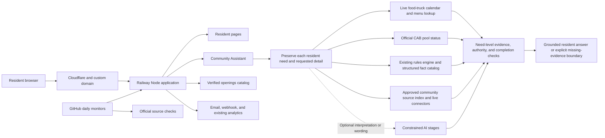

# System architecture

This is a deliberately small, single-service application for the product’s current traffic. The same tested code runs in separate Railway staging and production environments.

The diagram includes the September 18 need-first release candidate. Exact revision `ee4345c22953a453b6057fa33734a08835687900` is verified on staging; it is not released to production.

## Release boundaries

- `staging` deploys to the public but unadvertised test URL. Every page shows a purple staging badge, test traffic does not enter production Google Analytics, and notification destinations are disabled.
- `main` deploys to production. Railway sends traffic to a new release only after `/api/health` confirms that the rules index is ready.
- Daily GitHub checks exercise the homepage, security headers, rules answers, pool status, openings catalog, and eight days of food-truck lookups.
- Pull requests run fast checks followed by the complete deterministic quality gate. After a push to main or staging, CI checks the exact deployed revision and health instead of repeating the full suite. Ordinary CI explicitly disables model rewriting. See [the current release/testing reference](RELEASE-POLICY.md), including the September 13 changes in PRs #118 and #119.
- The separate **AI routing checks** workflow defaults to a small scheduled smoke profile. Full real-model benchmarks and compatible evidence reuse have their own scope; the full three-repeat benchmark is not the default for every run.
- The source-only publishing workflow still exists behind `COMMUNITY_AUTO_PROMOTE`. Its accessible repository flag was absent and its latest inspected run was skipped on September 13. Its one-hour source soak and rollback are conditional workflow behavior, not evidence that automatic publishing is active. The release reference distinguishes this from application releases and structured-interpreter trials.

## Failure boundaries

- The need-first candidate preserves each part of the resident's request before choosing a source path. Each need keeps its subject, requested outcome, conditions, date or location, and original wording. Success on one need cannot erase another.
- AI may propose an interpretation or improve wording when that stage is enabled, but it never supplies governing facts, links, prices, dates, contacts, or completion status. The accepted September 18 candidate adds no new model call; the deterministic path remains available when AI is disabled, unavailable, or rejected.
- Strong source-built answers bypass rewriting, reducing cost and avoiding unnecessary answer drift.
- Prompt-injection screening runs before source search or Anthropic, including attempts to disclose prompts, credentials, tokens, environment variables, or webhook URLs.
- Missing or conflicting current rule facts fail closed instead of being guessed.
- The shared interpretation layer normalizes common wording and typo variants, keeps unrelated meanings separate, records every requested answer facet before retrieval, and applies a live-source filter only when the resident explicitly requested one.
- A live connector may report an authoritative empty result only after the source and parser validate successfully. Filtered misses retain the unfiltered alternatives; partial or unavailable sources cannot produce a verified “none found” answer.
- A topic-neutral contract enforces explicit question forms such as permission, payment, cost, schedule, status, contact, and account access. Source retrieval and approved-fact selection must also match the object being requested: a fee for play cannot answer a parking-price question merely because both contain “free” or a dollar value.
- The coverage gate evaluates every preserved need and rejects answers that cite a relevant-looking section but omit the resident's requested price, limit, process, link, definition, duration, permission decision, or another requested part.
- The complete pre-merge gate covers the current historical corpus, broader family variants, unseen questions, and comparative answer checks. Use revision-specific reports for counts. Any regression blocks release.
- Official resident-resource links are cataloged separately from rules and checked daily, which prevents the assistant from treating a stale convenience link as a governing rule.
- A failed pool-source request sends residents to the official CAB page.
- Openings source changes are queued for human review rather than automatically published.
- Alert, Notion, analytics, and tip integrations cannot prevent the resident site from answering.

## Community Assistant boundaries

The existing rules engine retains authority for binding rules. The need-first coordinator separates compound questions, sends each need to the appropriate rules, community-source, or live-connector path, and then recombines only rendered claims with eligible evidence. The Community Assistant also provides tenant profiles, source ingestion and cleaning, hybrid retrieval, claim-level grounding, optional AI interpretation and synthesis, source conflict detection, and direct action links. These responsibilities live in separate modules; `lib/community-assistant.js` coordinates them without weakening the mature rules path.

All deployed environments default to the proven legacy resident answer flow. A candidate answer flow must be enabled explicitly for a bounded test; the environment name alone cannot activate it. This containment was added after the September 18 staging candidate replaced several richer, correct answers with minimally supported fragments.

The replacement candidate is complexity-routed. It builds the resident-needs contract and audits the existing grounded answer. A concise request stays on the richer existing path only when it is one complete need, contains no more than eight words, has no conditional or comparison marker, and the existing answer is grounded. Detailed, qualified, or multi-part requests use the need-by-need path even when the older answer carries a verified label. Safety and out-of-scope boundaries remain on the established path. This prevents a nearby source-backed fact from replacing the resident's requested details while preserving the strong presentation of simple answers.

The browser keeps at most three prior question-and-answer pairs in session storage. The server uses them only to turn a follow-up into a standalone search question, screens them for instruction attacks, and searches official evidence again. Prior answers are never treated as evidence. This temporary context is separate from the private logger, which saves individual sanitized question-and-answer records to configured Notion/webhook destinations. The owner's September 13 policy keeps saved question records indefinitely with no routine deletion or cleanup. See [question records and access](QUESTION-RECORDS.md) for the storage boundaries and unverified access details.

Every response has an `answerId`. A bounded operational trace records the route, planner goal and intent, source identifiers, verification result, source age, timing, fallback reason, and approximate AI token cost without retaining the resident's full wording. Question and subject consistency are tracked with salted, non-reversible fingerprints. If the same anonymized question changes routing outcomes, the health monitor records drift and blocks the live quality check. Food-truck questions use the same response contract and trace path as rules and services while retaining the standalone food-truck page for compatibility.

Every source refresh also rebuilds `data/rules-fact-catalog.json`. The catalog records each detected changing value with a stable fact key, normalized value, scope, effective and expiration dates, source URL, and source hash. The release check fails when that catalog no longer matches the rulebook or adopted supplements.

## Scaling trigger

The application intentionally uses one process and bounded in-memory caches/rate limits. If Railway is changed to run more than one production replica, move rate limits and shared caches to an edge or shared store before scaling. At the current single-replica traffic level, adding that infrastructure would add cost and operational complexity without improving resident outcomes.

## Reusable community-answer product

The product direction is broader than a rules chatbot. Its core promise is to make official community information direct, specific, human-readable, and easy to find. A customer starts with one input—the community's main public website—and the setup pipeline discovers and connects the official systems behind it.

The `/community-demo` staging page is the onboarding preview. The production-capable assistant behind `/community-assistant` now uses the generated community profile and approved index to answer resident questions. The preview never publishes scraped content automatically.

The existing Sterling Ranch Society tools provide the first reusable connectors and operating patterns:

- Rules and documents: Municode ingestion, supplement review, structured changing facts, citations, and answer audits.
- Community events: CivicPlus calendar ingestion, event-specific food-truck discovery, and the combined resident calendar.
- Facilities and actions: CivicPlus/CivicRec pages, current prices, direct booking or contact paths, and action-link coverage checks.
- Live status: the CAB pool page translated into accessible plain English.
- Local information: the openings catalog's source fingerprinting, review queue, and daily change monitor.

Each community receives a `community_id` and a source profile rather than copied Sterling Ranch logic. That profile records the official domains, platform, connectors, authority rules, refresh schedule, and launch evaluation set. Tenant filtering prevents cross-community evidence leakage. A live Castle Rock portability check exercises end-to-end answers from a second CivicPlus profile without core-code changes.

The intended source hierarchy is:

1. Adopted code, rule, or policy for what is allowed or required.
2. Current facility, form, payment, and registration systems for transactions, prices, availability, and required steps.
3. Current alerts and calendars for time-sensitive information.
4. Official informational pages for services, contacts, and explanations.

Freshness is part of the product rather than a one-time setup task. Every source retains its URL, fingerprint, last-checked time, and stale deadline. A changed bundle stays separate from the trusted version until its applicable review and collection, redirect, instruction-safety, structured-fact, live-link, retrieval, grounding, and answer gates pass. Broken optional links are removed; a missing protected action still blocks the answer gate. The conditional source publisher contains a one-hour staging soak and source-only rollback. Its activation and approval boundary are documented separately in [RELEASE-POLICY.md](RELEASE-POLICY.md); a freshness refresh does not authorize publication of changed facts.
