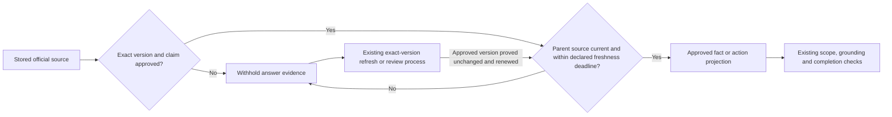

# Pending Notion: end-to-end experiments and expired projections

Prepared September 14, 2026. NOT sent: the earlier automatic approval review rejected the external update containing internal project/benchmark details; owner confirmation remains pending. Fetch each target before editing and preserve unrelated/historical content. After approval and editing, fetch to verify. Do not label the local fix live.

Audit target: https://www.notion.so/3dabf909186d81a2a090c2cb90183e96

Exact proposed addition:

## Full-answer comparison exposed an expired-source gap — September 14, 2026

**State: experiment stopped; shared repair implemented locally, 860 automated checks passed; not released or verified live.**

The first combined answer tests exposed problems that isolated tests did not: strict formatting broke the small interpretation model, an answer checker needed a separate field to preserve each requested part's identity, and some generated actions referenced source IDs instead of action IDs. Restoring the tested interpretation format and separating the identity field allowed more answers through, but repairs could still be slow and useful answers were inconsistent. No model or full implementation has been selected.

The local comparison was stopped when an audit found that approved source records could still enter search after their freshness deadline. Approval proves the exact version and permitted claims; it does not prove that the information remains current indefinitely. The shared evidence gate now checks the parent source's lifecycle and declared expiry before allowing either approved facts or actions. The existing refresh process must confirm the same approved version before expired evidence becomes eligible again. The repair does not approve or refresh anything itself.

Both comparison arms used a local source snapshot, which is different from proving the deployed sources' current state. The affected experiment cannot support a safe answer-quality percentage or a production cost commitment. Failed and interrupted requests remain in the cost record, including unknown charges. No resident log entries, live settings or subscriptions were changed.

Focused validation passed 39 checks, including source renewal, exact versions, separate communities and live-connector separation. The final full suite passed 860/860 checks. Supporting local records: `docs/COMMUNITY-FULL-FLOW-EXPERIMENT.md` and `docs/COMMUNITY-EXPIRED-PROJECTION-REPAIR.md`.

The full-suite investigation also repaired seven search/fallback calls that ignored the request's supplied date. Dated and outage-grace scenarios now use the same clock throughout retrieval. Positive tests tied to a fixed stored snapshot now use that snapshot's valid period; separate negative tests prove expired sources are withheld. The initial full run was 848/860, not a pass; the final rerun passed 860/860. A separate official-source refresh then verified all 60 approved URL groups without changing their approvals or versions. Three initial PDF checks failed because a local dependency was missing; the second run passed after installing the existing project dependencies. These are local test results, not a deployment claim.

How it works target: https://www.notion.so/3dabf909186d8166b507c2a4e1d1aced

Exact proposed explanation, labeled **local candidate; not verified live**:

For stored official pages and documents, the assistant checks two separate things before using a fact or action: whether that exact version and claim were approved, and whether the parent source is still current and within its freshness deadline. An old approval stays visible in the review history but cannot make expired information answerable. The existing refresh process can restore eligibility after proving the approved version is unchanged. Live connectors keep their separate freshness and authority checks.

Proposed static-evidence subflow for the existing answer-flow diagram (preserve the rest of the diagram):

The hub image at https://www.notion.so/3dabf909186d81789a09e4648dbb4bbe must be updated from the amended whole-flow diagram if/when this documentation is applied. This file prepares the change; it does not claim the image or external pages were updated.

Additional proposed audit paragraph: The experiment now requires a passing, unchanged and unexpired community revalidation before making model calls, rechecks it between questions, and saves the exact snapshots used. Eight offline experiment checks pass. Current community-page verification does not independently verify the separate rules snapshot. No additional paid capture, model selection or production release is implied.

Further proposed audit paragraph: The separate rules verification confirmed unchanged Municode publication metadata and unchanged text for all twelve named supplement documents. Four restricted documents were compared against their historical full-text hashes solely to verify identity; the approved answer excerpts were preserved. This checks named sources, not the absence of undiscovered amendments. The experimental acceptance contract now represents a partly answered need explicitly. New comparisons remain diagnostic and no candidate is selected for release. The comparison is now complete; results follow.

Exact proposed final audit addition: The fresh full-answer comparison completed all 48 diagnostic attempts. At this question mix, measured answering AI costs per 1,000 attempted questions were approximately $1.01 for the current local baseline, $39.16 for the Haiku-writer candidate, and $57.00 for the Sonnet-writer candidate; both candidates also used Haiku interpretation and Sonnet checking. Both candidates failed to deliver an accepted answer on 2/16 attempts, and an accepted lighting-application follow-up still included an unrelated landscaper-directory link. Their p95 times were 22.9 and 34.7 seconds, above the proposed ten-second target. Neither candidate is recommended for release. The current local baseline also falsely labels unanchored cost answers complete. These are diagnostic results, not independently human-rated usefulness or production bills. Stage tokens, monthly scenarios, failed-attempt spending and unmeasured hosting/background grading are recorded in the local full-flow cost decision. A separate zero-API-cost semantic retrieval comparison recovered the missing pergola rule but did not fix process-link relevance. Human calibration, live-adapter integration, unseen validation and verified release remain outstanding.
