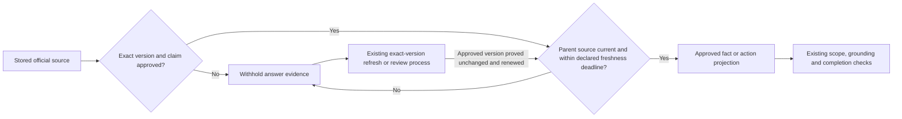

# Pending Notion: end-to-end experiments and expired projections

Prepared September 14, 2026. NOT sent: the earlier automatic approval review rejected the external update containing internal project/benchmark details; owner confirmation remains pending. Fetch each target before editing and preserve unrelated/historical content. After approval and editing, fetch to verify. Do not label the local fix live.

Audit target: https://www.notion.so/3dabf909186d81a2a090c2cb90183e96

Exact proposed addition:

## Full-answer comparison exposed an expired-source gap — September 14, 2026

**State: experiment stopped; shared repair implemented locally, 860 automated checks passed; not released or verified live.**

The first combined answer tests exposed problems that isolated tests did not: strict formatting broke the small interpretation model, an answer checker needed a separate field to preserve each requested part's identity, and some generated actions referenced source IDs instead of action IDs. Restoring the tested interpretation format and separating the identity field allowed more answers through, but repairs could still be slow and useful answers were inconsistent. No model or full implementation has been selected.

The local comparison was stopped when an audit found that approved source records could still enter search after their freshness deadline. Approval proves the exact version and permitted claims; it does not prove that the information remains current indefinitely. The shared evidence gate now checks the parent source's lifecycle and declared expiry before allowing either approved facts or actions. The existing refresh process must confirm the same approved version before expired evidence becomes eligible again. The repair does not approve or refresh anything itself.

Both comparison arms used a local source snapshot, which is different from proving the deployed sources' current state. The affected experiment cannot support a safe answer-quality percentage or a production cost commitment. Failed and interrupted requests remain in the cost record, including unknown charges. No resident log entries, live settings or subscriptions were changed.

Focused validation passed 39 checks, including source renewal, exact versions, separate communities and live-connector separation. The final full suite passed 860/860 checks. Supporting local records: `docs/COMMUNITY-FULL-FLOW-EXPERIMENT.md` and `docs/COMMUNITY-EXPIRED-PROJECTION-REPAIR.md`.

The full-suite investigation also repaired seven search/fallback calls that ignored the request's supplied date. Dated and outage-grace scenarios now use the same clock throughout retrieval. Positive tests tied to a fixed stored snapshot now use that snapshot's valid period; separate negative tests prove expired sources are withheld. The initial full run was 848/860, not a pass; the final rerun passed 860/860. A separate official-source refresh then verified all 60 approved URL groups without changing their approvals or versions. Three initial PDF checks failed because a local dependency was missing; the second run passed after installing the existing project dependencies. These are local test results, not a deployment claim.

How it works target: https://www.notion.so/3dabf909186d8166b507c2a4e1d1aced

Exact proposed explanation, labeled **local candidate; not verified live**:

For stored official pages and documents, the assistant checks two separate things before using a fact or action: whether that exact version and claim were approved, and whether the parent source is still current and within its freshness deadline. An old approval stays visible in the review history but cannot make expired information answerable. The existing refresh process can restore eligibility after proving the approved version is unchanged. Live connectors keep their separate freshness and authority checks.

Proposed static-evidence subflow for the existing answer-flow diagram (preserve the rest of the diagram):

The hub image at https://www.notion.so/3dabf909186d81789a09e4648dbb4bbe must be updated from the amended whole-flow diagram if/when this documentation is applied. This file prepares the change; it does not claim the image or external pages were updated.

Additional proposed audit paragraph: The experiment now requires a passing, unchanged and unexpired community revalidation before making model calls, rechecks it between questions, and saves the exact snapshots used. Eight offline experiment checks pass. Current community-page verification does not independently verify the separate rules snapshot. No additional paid capture, model selection or production release is implied.

Further proposed audit paragraph: The separate rules verification confirmed unchanged Municode publication metadata and unchanged text for all twelve named supplement documents. Four restricted documents were compared against their historical full-text hashes solely to verify identity; the approved answer excerpts were preserved. This checks named sources, not the absence of undiscovered amendments. The experimental acceptance contract now represents a partly answered need explicitly. New comparisons remain diagnostic and no candidate is selected for release. The comparison is now complete; results follow.

Exact proposed final audit addition: The fresh full-answer comparison completed all 48 diagnostic attempts. At this question mix, measured answering AI costs per 1,000 attempted questions were approximately $1.01 for the current local baseline, $39.16 for the Haiku-writer candidate, and $57.00 for the Sonnet-writer candidate; both candidates also used Haiku interpretation and Sonnet checking. Both candidates failed to deliver an accepted answer on 2/16 attempts, and an accepted lighting-application follow-up still included an unrelated landscaper-directory link. Their p95 times were 22.9 and 34.7 seconds, above the proposed ten-second target. Neither candidate is recommended for release. The current local baseline also falsely labels unanchored cost answers complete. These are diagnostic results, not independently human-rated usefulness or production bills. Stage tokens, monthly scenarios, failed-attempt spending and unmeasured hosting/background grading are recorded in the local full-flow cost decision. A separate zero-API-cost semantic retrieval comparison recovered the missing pergola rule but did not fix process-link relevance. Human calibration, live-adapter integration, unseen validation and verified release remain outstanding.
## Additional precise pending update: approved catalog and action checking

Status: locally implemented evaluation tools; unselected and not deployed. Append to the flow explanation and decisions pages after fetching their current contents. Preserve unrelated owner edits. External synchronization remains pending because automatic approval review rejected the earlier Notion write; the requested confirmation has not arrived.

Proposed explanation: “The experimental flow can give the writer the full small set of current, approved community facts and links. The verified snapshot contains 25 such projections with 5,502 characters. This is tested before adding semantic retrieval for community links; semantic retrieval remains a separate candidate for the larger rules library. A request solely for a form does not need unrelated rule text. Separate questions about permission still receive governing rules. Identical expanded policy sections appear once, with their full source identities retained.”

Proposed authority note: “The owner's September 6 approval already permits staging tests of the General Architectural Improvement application and Landscape Submittal Packet. A separate default-off experimental option exposes only those exact approved versions' titles and direct URLs. It does not promote production approvals or authorize facts about fees, applicability or requirements.”

Proposed diagnostic record: “On September 14, explicit checking of each action caught the known lighting-to-landscaper mistake twice and retained all six useful controls. Eight of ten checks returned valid expected results; two identified an irrelevant extra action but returned contradictory failure labels and empty repair explanations, so local validation rejected them. This is a small diagnostic, not human calibration. Checker latency alone was median 10.738 seconds and p95 18.720 seconds. Ten calls cost $0.134170; no new model selection, subscription or release resulted. Offline catalog retrieval replay completed seven interpretations in three modes without provider calls; final-answer quality remains unmeasured.”

Diagram/text delta, experimental branch only: interpretation → governing-rule retrieval for relevant needs + complete approved community catalog → deduplicate full sections and preserve scope → compose → assess each requested need and every selected action → at most one explained repair → validated candidate or unresolved result. Mark form navigation as separately authorized for staging only. Update the hub image when this proposed experiment diagram is synchronized; do not replace the live flow diagram with an experiment.

Supporting local records: `docs/COMMUNITY-FULL-FLOW-COST-DECISION.md`, `docs/COMMUNITY-FULL-FLOW-EXPERIMENT.md`, `artifacts/quality-eval/flow-action-checks-20260914`, `artifacts/quality-eval/complete-catalog-replay-v2-20260914`, and `data/community-form-approval-evidence.json`. Seventeen focused checks pass. Full-answer catalog quality, independent ratings, live-adapter integration, selected operating cost, release and verified-live readiness remain outstanding.
## Additional precise pending update: runtime clarification dependency

Targets: How the project works (https://www.notion.so/3dabf909186d8166b507c2a4e1d1aced), Decisions (https://www.notion.so/3dabf909186d8139ac52ebdbf77d8bea), and the audit follow-ups. Fetch before editing; preserve unrelated content. Status: local runtime repair, not deployed or verified live. Synchronization remains pending the earlier rejected external write and unanswered confirmation.

Proposed text: “A broad request shape such as ‘how much’ does not establish what the resident means. When the validated planner asks for clarification and the question still depends on earlier context, the coordinator now preserves the clarification before retrieval. It uses the existing conversation dependency decision. Complete named-topic questions and questions with resolved resident context still use the normal evidence path, allowing supported answers to override an unnecessary AI clarification. This adds no model call; interpretation cost remains and savings have not been measured.”

Diagram delta for the locally implemented branch: after validated interpretation, add “clarification requested + still context-dependent?” → existing clarification response; otherwise continue normal authoritative retrieval. Preserve the current live diagram until release verification. When the local diagram is synchronized, update its accessible text and the matching hub image with the same local/not-live label.

Evidence: `test/community-clarification-dependency.test.js` reproduced unwanted rules retrieval before the repair and passed afterward, covering two communities, cost/permission/timing/location, structured mode and legacy cost planning. The focused 77-test run passed existing complete-question, conversation, live service and degradation checks. Final full-suite evidence and revision are recorded in the active checkpoint and experiment report. No source, profile, approval, UI layout, subscription or live deployment changed. Experimental live-adapter integration and final demo acceptance remain incomplete.
## Additional precise pending update: multi-day live calendar health

Targets: How the project works, Decisions, and Owner operations and privacy (https://www.notion.so/3dabf909186d81028da2d4e84f033e77). Fetch before editing. Status: local runtime repair, not deployed or verified live; external synchronization remains pending the earlier rejected write.

Proposed text: “A calendar answer covering several days now retains a failed refresh in its combined status. Previously, one retained day and one successfully refreshed day could become a healthy combined result. The shared calendar combiner now reports partial/degraded coverage when any day is degraded, keeps the oldest checked time and earliest expiry, and preserves the existing retained events without treating them as newly verified. Expired daily evidence still fails through the existing adapter boundary. The same repair applies to both configured community profiles and adds no AI or external request.”

Diagram/text delta: every fetched calendar day → combine dates plus worst health, oldest observation and earliest expiry → existing completion/withholding gate. A fresh day must not renew or clear another day's failure. Update the matching diagram text and hub image only with the explicit local/not-live state until release verification.

Evidence: `artifacts/quality-eval/calendar-range-degradation-before-20260914.json`, `test/community-calendar-range-degradation.test.js`, and `test/community-connector-strict-integration.test.js`. Five focused tests pass, covering two profiles, one/all daily refresh failures, healthy ranges, retained data and expired evidence. This is offline fixture verification, not an assertion that the public calendar was failing or that a live fix has shipped.
## Final local verification for the two runtime additions

The combined clarification/calendar runtime suite passed 874/874 checks on September 14, zero failed/cancelled/skipped, in 277,323 ms. Exact log: `artifacts/quality-eval/clarification-calendar-suite-final-20260914.log`; saved exit code: 0. Syntax and resident-literal checks pass. The earlier clarification-only full-suite log is interrupted and supplies no final pass claim. The local commit is recorded in the active-work checkpoint. These results do not verify deployment, independent answer quality, or the September demo targets.
