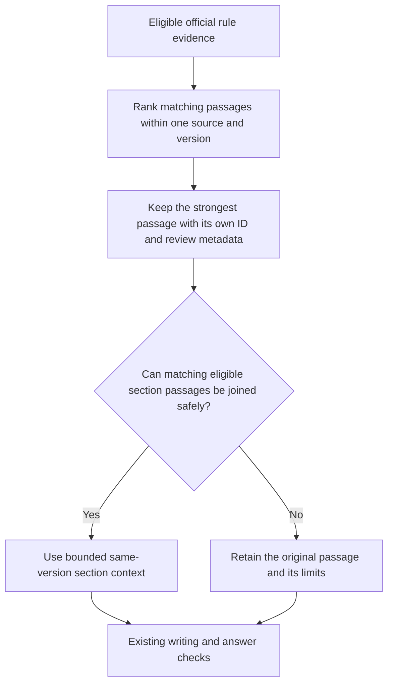

# Pending Notion update: search identity and requested outcomes

Status: pending; not synchronized. Automatic approval review rejected the earlier external checkpoint update containing internal paths and benchmark details. The owner confirmation remains pending. Do not retry the external write or treat a general goal continuation or filesystem-permission change as that confirmation.

Affected pages: [How the project works](https://www.notion.so/3dabf909186d8166b507c2a4e1d1aced), [hub](https://www.notion.so/3dabf909186d81789a09e4648dbb4bbe), and [audit](https://www.notion.so/3dabf909186d81a2a090c2cb90183e96). Fetch each page before an authorized edit and preserve unrelated sections and dated live diagrams. Supporting local code: `lib/rules-assistant.js`, `lib/rules-section-context.js`; explanation and measured results: `docs/COMMUNITY-SEARCH-IDENTITY-REPAIR-2026-09-14.md`. Exact commit is recorded in the task's ACTIVE-WORK checkpoint after committing. No live revision is claimed.

## Exact audit addition

### Quality goal: source identity repair and request-specific search · September 14, 2026

Local candidate only; no release, model selection, source approval or new subscription. Keyword search could return a later passage with an earlier passage's ID and metadata. The repair carries the entire winning passage and keeps different source/community/version identities separate. Across 32 authored diagnostic questions, mismatches fell from 49 results in 24 questions to zero. The final full local suite passed 846/846; the resident-literal check passed. An earlier interrupted full run is excluded.

The original semantic comparison also saved some wrong keyword/hybrid passages because it trusted the mismatched IDs. Its title/rank observations remain limited descriptive evidence; corrected passage analysis must use the subsequent recapture. Existing vectors were reused after exact model, scoped corpus and window checks. No paid API calls were added.

Two further comparisons each tested 42 requested-outcome queries derived from 32 existing model plans. More precise task wording helped one form retrieval but did not consistently solve application questions. No search variant or model is selected, and no useful/excellent answer rate is certified.

The repository already contains architectural and landscaping application PDFs, but its local approval gate does not permit their answer or action projections. It permits the forms-directory navigation link only. A fresh official-site read confirms the current 2026 directory links; search-engine cached versions were older. Prepare narrowly scoped, exact-version form/action review candidates without treating a PDF link as permission or fee authority. This diagnosis is based on the repository gate, not a new production approval audit.

Full-flow quality and cost evidence, independent rating calibration, shared request/evidence acceptance and live demo validation remain open.

## Exact candidate-flow addition for How and hub

Add the following as a **local candidate rules-evidence subflow**, separate from the dated live diagram. Render it as a diagram/image with the accessible explanation below; update the hub's candidate image when authorized. Do not replace or advance the live diagram's verification date.

Accessible explanation: Search now keeps the actual selected passage's identity. Only matching eligible pieces of the same section and version can be joined within the context budget. When that cannot be established, the original limited passage is retained. Existing answer generation and checks follow. The planned shared requested-outcome acceptance gate is not yet implemented. This local repair does not prove an answer is relevant, complete or demo-ready.
