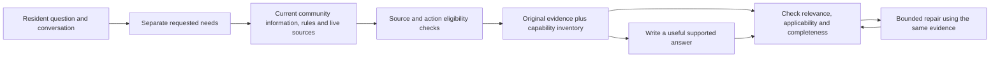

# Pending multi-role evidence contract explanation

Targets: [How the project works](https://www.notion.so/3dabf909186d8166b507c2a4e1d1aced), proposed September answer flow; [Decisions and their reasons](https://www.notion.so/3dabf909186d8139ac52ebdbf77d8bea), source routing decision. Fetch before an authorized edit and preserve unrelated content.

Status: implemented only as an optional local experimental input contract. It has not been adopted, tested with paid writers/checkers, deployed or verified live. Synchronization remains pending the prior automatic approval review rejection of publishing internal experiment/status details. No external retry was made.

Intended explanation:

> One resident need can use rules, practical information and an action link together. The experimental flow keeps broad retrieval and gives the writer, repair step and checker a shared inventory distinguishing factual text, navigation-only links and scoped live observations. Need and source identities, community, versions, live expiry, retrieval gaps and omissions remain attached. The inventory explicitly does not judge relevance or answer completeness. Related text still needs independent applicability review; approved navigation cannot establish an unsupported fact.
>
> Twenty-four focused checks pass, including two communities and propagation through initial composition, repair and acceptance. A historical transformation preserved every source and action in thirty saved broad-search packets and rejected thirty packets produced by the previously rejected exclusive-routing shortcut. No model call was made. The added request size is median 3,160 / sample p95 4,348 characters; token costs and answer-quality benefit remain unmeasured. Keep this optional until the gain justifies overhead. No production behavior changed.

Proposed diagram and accessible text (clearly labeled experimental, preserve the existing live diagram):

Accessible text: The experimental flow preserves each requested need, retrieves several source roles, validates current eligible evidence, and passes the unchanged evidence plus an unverified capability inventory to writing and checking. A bounded repair uses the same evidence. The inventory itself does not approve an answer. Source failure and missing support remain explicit.

Evidence: docs/COMMUNITY-REQUEST-EVIDENCE-CONTRACT-PROPOSAL.md; capture revision 0618fda8261387af6618254f5a781abdc26b8d7a; artifacts/quality-eval/need-evidence-contract-20260915/comparison.json. Historical source validity is checked at the original broad replay end, not described as current live evidence.
